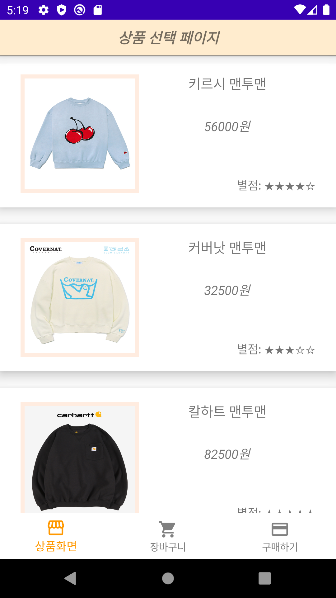
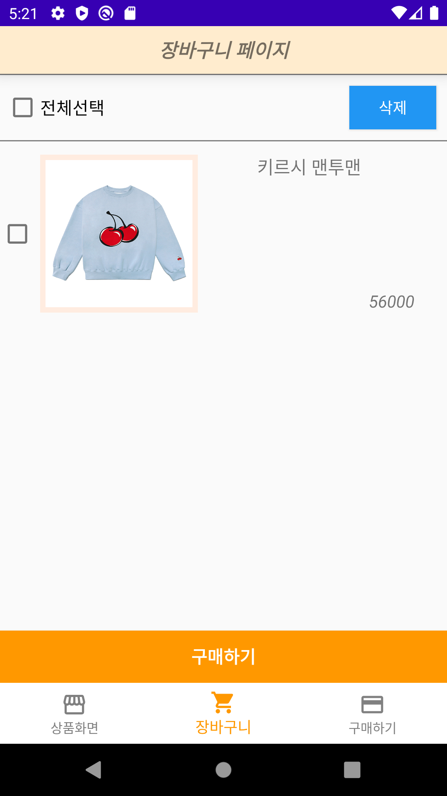
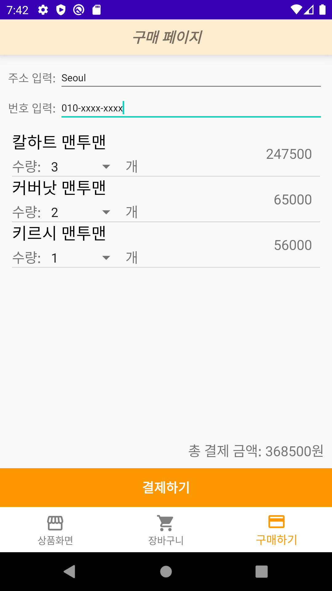
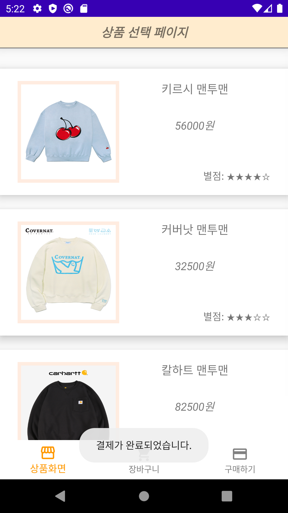

BuyClothes

국민대학교 모바일프로그래밍 첫번째 개인과제에 대한 프로젝트입니다.

20191633 윤서영

Github: https://github.com/young43/BuyClothesApplication

<br>

## 목차

- [1. 프로젝트 설명](#1-프로젝트-설명)
  - [1.1 프로젝트 개요](#11-프로젝트-개요)
  - [1.2 소스파일 구성](#12-소스파일-구성)
  - [1.3 개발환경](#13-개발환경)
  - [1.4 실행환경](#14-실행환경)
  
- [2. UI 설계](#2-UI-설계)
  - [2.1 첫번째 화면(Main)](#21-첫번째-화면main)
  - [2.2 두번째 화면(장바구니)](#22-두번째-화면장바구니)
  - [2.3 세번째 화면(구매)](#23-세번째-화면구매)

- [3. 구현내용](#3-구현내용)
  - [3.1 Activity](#31-Activity)
  - [3.2 Fragment](#32-Fragment)
  - [3.3 Dialog](#33-Dialog)
  - [3.4 Custom ListView](#34-Custom-ListView)

<br>

## 1. 프로젝트 설명

### 1.1 프로젝트 개요

2개 이상의 상품을 화면에 출력하고, 상품을 선택하면 장바구니 또는 구매화면으로 이동할 수 있게 한다. 장바구니 화면에서는 여러 상품을 체크하여 구매화면으로 이동할 수 있다. 마지막 구매화면에서는 선택한 제품명과 가격 정보를 출력하고, 주소 및 연락처를 입력할 수 있다. 최종적으로 구매 완료시, 다시 상품선택 화면으로 이동하게 된다.

### 1.2 소스파일 구성

| 파일 명                 | 역할                                                         |
| ----------------------- | ------------------------------------------------------------ |
| MainActivity.java       | 가장 처음으로 실행되는 메인 액티비티이다.                    |
| ProductFragment.java    | 첫번째 화면(상품선택 화면)에 대한 프래그먼트이다.            |
| CartFragment.java       | 두번째 화면(장바구니 화면)에 대한 프래그먼트이다.            |
| BuyFragment.java        | 세번째 화면(구매 화면)에 대한 프래그먼트이다.                |
| CustomDialog.java       | 상품을 클릭했을 때, 구매/장바구니 버튼을 보여주는 커스텀 다이얼로그이다. |
| ListViewItem.java       | 장바구니에 담긴 상품 리스트에 대한 아이템 클래스이다.        |
| ListViewAdapter.java    | 장바구니에 담긴 상품 리스트를 보여주기위한 어댑터이다.       |
| BuyListViewItem.java    | 구매할 상품 리스트에 대한 아이템 클래스이다.                 |
| BuyListViewAdapter.java | 구매할 상품 리스트를 보여주기위한 어댑터이다.                |

### 1.3 개발환경

- Language: Java
- IDE: Android Studio

### 1.4 실행환경

- AVD: Android Q(10.0 x86_64)
- Compile
  - minSDKVersion: 16
  - compileSDKVersion: 30

<br>

## 2. UI 설계

| 레이아웃 명           | 연결               | 역할                                                 |
| --------------------- | ------------------ | ---------------------------------------------------- |
| activity_main.xml     | MainActivity       | 메인 액티비티에 연결되는 레이아웃이다.               |
| fragment_product.xml  | ProductFragment    | 첫번째 화면(상품 리스트) 레이아웃이다.               |
| fragment_cart.xml     | CartFragment       | 두번째 화면(장바구니) 레이아웃이다.                  |
| fragment_buy.xml      | BuyFragment        | 세번째 화면(구매) 레이아웃이다.                      |
| custom_dialog.xml     | CustomDialog       | 사용자정의 다이얼로그에 대한 레이아웃이다.           |
| listview_item.xml     | ListViewAdapter    | 장바구니 화면의 리스트뷰에 대한 아이템 레이아웃이다. |
| listview_item_buy.xml | BuyListViewAdapter | 구매 화면의 리스트뷰에 대한 아이템 레이아웃이다.     |

### 2.1 첫번째 화면(Main)

첫번째 화면은 2개 이상의 상품 리스트를 보여주고, 선택하면 커스텀 다이얼로그를 띄우게 된다. 

커스텀 다이얼로그에는 구매 버튼과 장바구니 버튼이 존재한다. 



### 2.1.1 레이아웃

Main 액티비티의 레이아웃은 _activity_main.xml_ 파일에 구성되어있다.  또한, 최상위 부모 View는 ConstraintLayout이며, 자식은 BottomNavigationView와 FrameLayout 으로 구성되어있다. 

```xml
<com.google.android.material.bottomnavigation.BottomNavigationView
        android:id="@+id/bottomNavi"
        android:layout_width="match_parent"
        android:layout_height="wrap_content"
        app:itemBackground="@color/white"
        app:itemIconTint="@drawable/tab_color"
        app:itemTextColor="@drawable/tab_color"
        app:layout_constraintBottom_toBottomOf="parent"
        app:menu="@menu/main_menu"
        tools:layout_editor_absoluteX="16dp" />

    <FrameLayout
        android:id="@+id/Main_Frame"
        android:layout_width="match_parent"
        android:layout_height="0dp"
        app:layout_constraintBottom_toTopOf="@+id/bottomNavi"
        app:layout_constraintEnd_toEndOf="parent"
        app:layout_constraintHorizontal_bias="0.0"
        app:layout_constraintStart_toStartOf="parent"
        app:layout_constraintTop_toTopOf="parent"/>
```

### 2.1.2 ProductFragment 레이아웃

Main 액티비티는 사실상 하단 네비게이션바와 FramLayout 으로만 구성이 되어있다. 따라서, 각 Fragment 들은 또 다른 레이아웃들로 구성하여 FramLayout에 연결되는 구조로 되어있다.

상품 리스트 화면 레이아웃은 _fragment_product.xml_ 파일에 구성되어있다.

최상위 부모 View는 RelativeLayout으로 설정하였고, LinearLayout과 ScrollView를 사용하여 상품들을 스크롤 하면서 볼 수 있도록 하였다. 각 상품에 대한 정보(가격, 이미지 등)들은 RelativeLayout 안에 생성하였고, 필요시 id를 할당해 주었다.

```xml
<RelativeLayout
    android:layout_width="match_parent"
    android:layout_height="180dp"
    android:layout_marginTop="20dp"
    android:background="@drawable/background_border"
    android:elevation="10dp"
    android:id="@+id/layout_product1">

    <ImageView
        android:layout_width="145dp"
        android:layout_height="145dp"
        android:layout_centerVertical="true"
        android:layout_marginLeft="25dp"
        android:src="@drawable/product1"
        android:background="#FFECE0"
        android:scaleType="fitXY"
        android:padding="5dp"
        android:id="@+id/imgv_product1"/>

    <LinearLayout
        android:layout_width="match_parent"
        android:layout_height="wrap_content"
        android:layout_marginRight="25dp"
        android:layout_alignTop="@+id/imgv_product1"
        android:layout_toRightOf="@+id/imgv_product1"
        android:orientation="vertical">
        
        <TextView
            android:layout_width="match_parent"
            android:layout_height="wrap_content"
            android:gravity="center"
            android:textSize="7.5pt"
            android:text="키르시 맨투맨"
            android:id="@+id/textv_product_title1"/>

        <TextView
            android:layout_width="match_parent"
            android:layout_height="wrap_content"
            android:layout_marginTop="30dp"
            android:gravity="center"
            android:textSize="7pt"
            android:textStyle="italic"
            android:text="56000원"
            android:id="@+id/textv_product_price1"/>
    </LinearLayout>

    <TextView
        android:layout_width="wrap_content"
        android:layout_height="wrap_content"
        android:layout_alignBottom="@id/imgv_product1"
        android:layout_alignParentRight="true"
        android:layout_marginRight="25dp"
        android:text="별점: ★★★★☆"/>
</RelativeLayout>
```

### 2.2 두번째 화면(장바구니)

장바구니 화면은 장바구니에 추가한 상품들에 대한 리스트를 출력해준다. 체크박스를 사용하여 상품을 선택할 수 있고, 장바구니에서 삭제할 수도 있다. 



### 2.2.1 레이아웃

상단에는 전체선택 체크박스가 존재하고, 클릭하면 각 상품들이 전부 체크된다. 또한 삭제버튼과 구매하기 버튼이 존재한다. 최상위 부모 View는 LinearLayout으로 되어있으며, 장바구니 리스트는 ListView와 ScrollView를 활용하여 보여주도록 하였다. 

장바구니 화면 레이아웃은 _fragment_cart.xml_ 파일에 구성되어있다.

```xml
<?xml version="1.0" encoding="utf-8"?>
<LinearLayout xmlns:android="http://schemas.android.com/apk/res/android"
    xmlns:tools="http://schemas.android.com/tools"
    android:layout_width="match_parent"
    android:layout_height="match_parent"
    tools:context=".CartFragment"
    android:orientation="vertical">
    
    <TextView
        android:layout_width="match_parent"
        android:layout_height="wrap_content"
        android:layout_centerHorizontal="true"
        android:gravity="center_horizontal|center_vertical"
        android:id="@+id/textv_title2"
        android:text="@string/title2"
        android:textSize="8pt"
        android:textStyle="bold|italic"
        android:paddingTop="10dp"
        android:paddingBottom="10dp"
        android:background="#FFECCE"
        android:elevation="10dp"/>

    <RelativeLayout
        android:layout_width="match_parent"
        android:layout_height="50dp"
        android:orientation="horizontal"
        android:layout_marginTop="5dp"
        android:layout_marginBottom="5dp"
        android:layout_marginLeft="5dp">
        
        <CheckBox
            android:id="@+id/checkbox_all"
            android:layout_width="wrap_content"
            android:layout_height="match_parent"
            android:gravity="center"
            android:backgroundTint="#2196F3" />

        <TextView
            android:layout_width="wrap_content"
            android:layout_height="match_parent"
            android:text="전체선택"
            android:gravity="center_vertical"
            android:textSize="16dp"
            android:textColor="#000000"
            android:layout_toRightOf="@id/checkbox_all"/>

        <Button
            android:id="@+id/button_delete"
            android:layout_width="80dp"
            android:layout_height="40dp"
            android:layout_alignParentRight="true"
            android:layout_centerVertical="true"
            android:layout_marginRight="10dp"
            android:background="#2196F3"
            android:text="삭제"
            android:textColor="#FFFFFF"/>
    </RelativeLayout>

    <ScrollView
        android:layout_width="match_parent"
        android:layout_height="match_parent"
        android:layout_weight="1">
        <LinearLayout
            android:layout_width="match_parent"
            android:layout_height="match_parent">
            <ListView
                android:id="@+id/list_cart"
                android:layout_width="match_parent"
                android:layout_height="match_parent"
                android:choiceMode="multipleChoice"/>
        </LinearLayout>
    </ScrollView>

    <Button
        android:id="@+id/button_purchase"
        android:layout_width="match_parent"
        android:layout_height="wrap_content"
        android:text="구매하기"
        android:textSize="16dp"
        android:textStyle="bold"
        android:background="#FF9800"
        android:textColor="#FFFFFF"/>
</LinearLayout>
```

### 2.2.2 ListViewItem 레이아웃

장바구니 화면의 리스트는 각 item에 이미지를 포함하기 위해서 item에 대한 레이아웃을 따로 정의하였다.  RelativeLayout안에 Checkbox, ImageView, TextView를 통해 상품 정보를 보여주고자 하였다. 

장바구니 리스트 ltem 레이아웃은 _listview_item.xml_ 파일에 구성되어있다.

```xml
<RelativeLayout
android:layout_width="match_parent"
android:layout_height="170dp"
android:elevation="10dp">

<CheckBox
    android:layout_width="wrap_content"
    android:layout_height="wrap_content"
    android:id="@+id/checkbox1"
    android:layout_centerVertical="true" />

<ImageView
    android:layout_width="145dp"
    android:layout_height="145dp"
    android:layout_marginLeft="5dp"
    android:layout_centerVertical="true"
    android:src="@drawable/product1"
    android:background="#FFECE0"
    android:scaleType="fitXY"
    android:padding="5dp"
    android:id="@+id/imageView1"
    android:layout_toRightOf="@id/checkbox1" />

<LinearLayout
    android:layout_width="match_parent"
    android:layout_height="wrap_content"
    android:layout_marginRight="25dp"
    android:layout_alignTop="@+id/imageView1"
    android:layout_toRightOf="@+id/imageView1"
    android:orientation="vertical">

    <TextView
        android:layout_width="match_parent"
        android:layout_height="wrap_content"
        android:gravity="center"
        android:textSize="7.5pt"
        android:text="키르시 맨투맨"
        android:id="@+id/textView1" />
</LinearLayout>

<TextView
    android:layout_width="wrap_content"
    android:layout_height="wrap_content"
    android:textSize="7pt"
    android:textStyle="italic"
    android:text="56000원"
    android:id="@+id/textView2"
    android:layout_alignBottom="@id/imageView1"
    android:layout_alignParentRight="true"
    android:layout_marginRight="30dp" />
</RelativeLayout>
```

### 2.3 세번째 화면(구매)

구매 화면에서는 결제를 진행할 상품 리스트와 결제 총합을 출력한다. 선택한 상품이 여러개일 경우, 총합으로 계산하여 보여주고 수량을 수정할 수 있다. 구매자의 주소와 연락처를 입력해야만 결제를 진행할 수 있다. 최종적으로 결제가 완료되면, 다시 첫 화면(상품 선택 화면)으로 돌아간다.





### 2.3.1 레이아웃

최상위 부모 View는 GridLayout으로 구성하였다. 상단에는 주소와 연락처를 입력받을 수 있도록 EditText를 사용하였고, 장바구니 화면과 마찬가지로 구매할 상품 리스트를 보여주기위해 ListView와 ScrollView를 사용하였다. 하단에는 결제하기 버튼이 존재한다. 

구매 화면 레이아웃은 _fragment_buy.xml_ 파일에 구성되어있다.

```xml
<GridLayout 	xmlns:android="http://schemas.android.com/apk/res/android"
    xmlns:tools="http://schemas.android.com/tools"
    android:layout_width="match_parent"
    android:layout_height="match_parent"
    tools:context=".BuyFragment"
    android:columnCount="3"
    android:rowCount="10">

    <TextView
        android:layout_row="0"
        android:layout_column="0"
        android:layout_columnSpan="3"
        android:id="@+id/textv_title3"
        android:text="@string/title3"
        android:textSize="8pt"/>

    <TextView
        android:layout_row="1"
        android:layout_column="0"
        android:text="주소 입력: "
        android:textSize="14dp"/>

    <EditText
        android:id="@+id/edit_address"
        android:layout_row="1"
        android:layout_column="1"
        android:layout_columnSpan="2"
        android:hint="주소를 입력해주세요."
        android:textSize="12dp"/>

    <TextView
        android:layout_row="2"
        android:layout_column="0"
        android:text="번호 입력: "
        android:textSize="14dp"/>

    <EditText
        android:id="@+id/edit_phoneNumber"
        android:layout_row="2"
        android:layout_column="1"
        android:layout_columnSpan="2"
        android:hint="번호를 입력해주세요."
        android:textSize="12dp"/>

    <ScrollView
        android:layout_row="3"
        android:layout_column="0"
        android:layout_columnSpan="3"
        android:layout_rowSpan="5">
        <LinearLayout
            android:layout_width="match_parent"
            android:layout_height="wrap_content">
            <ListView
                android:id="@+id/list_buy"
                android:layout_width="match_parent"
                android:layout_height="wrap_content"/>
        </LinearLayout>
    </ScrollView>

    <LinearLayout
        android:layout_row="8"
        android:layout_column="0"
        android:layout_columnSpan="3"
        android:orientation="horizontal"
        android:gravity="right">

        <TextView
            android:layout_width="wrap_content"
            android:layout_height="match_parent"
            android:text="총 결제 금액: "
            android:textSize="17dp"/>

        <TextView
            android:id="@+id/textv_total_price"
            android:layout_width="wrap_content"
            android:layout_height="match_parent"
            android:textSize="17dp"/>
    </LinearLayout>

    <Button
        android:id="@+id/button_payment"
        android:layout_row="9"
        android:layout_column="0"
        android:layout_columnSpan="3"
        android:text="결제하기"
        android:textSize="16dp"/>
</GridLayout>
```

또한, GridLayout 안에 컴포넌트들은 아래 표와 같이 구성되어있다. 총 10행 3열인 GridLayout이다. 


### 2.3.2 BuyListViewItem 레이아웃

장바구니 화면과 마찬가지로 구매 화면에서도 구매할 상품의 리스트를 출력해야한다. 각 item 마다 필요한 정보들이 따로 존재하며, 수량을 표시하기위해 spinner를 정의하고자 하였다. 따라서 item에 대한 레이아웃을 따로 정의하였다.  GridLayout안에 TextView와 Spinner 컴포넌트로 구성하였다. 

구매 리스트 ltem 레이아웃은 _listview_item_buy.xml_ 파일에 구성되어있다.

```xml
<GridLayout xmlns:android="http://schemas.android.com/apk/res/android"
    android:layout_width="match_parent"
    android:layout_height="wrap_content"
    android:layout_margin="15dp"
    android:rowCount="2"
    android:columnCount="3">

    <TextView
        android:layout_row="0"
        android:layout_column="0"
        android:id="@+id/textv_buy_product"
        android:layout_width="wrap_content"
        android:layout_height="wrap_content"
        android:text="상품명"
        android:textSize="20dp"/>

    <LinearLayout
        android:orientation="horizontal"
        android:layout_row="1"
        android:layout_column="0">

        <TextView
            android:layout_width="wrap_content"
            android:layout_height="wrap_content"
            android:text="수량: "
            android:textSize="17dp"/>

        <Spinner
            android:id="@+id/spinner_cnt"
            android:layout_width="100dp"
            android:layout_height="match_parent"/>

        <TextView
            android:layout_width="wrap_content"
            android:layout_height="match_parent"
            android:text="개"
            android:textSize="17dp"/>
    </LinearLayout>

    <TextView
        android:layout_row="0"
        android:layout_column="1"
        android:layout_columnSpan="2"
        android:layout_rowSpan="2"
        android:gravity="right"
        android:id="@+id/textv_buy_price"
        android:layout_width="wrap_content"
        android:layout_height="wrap_content"
        android:text="가격"
        android:textSize="17dp"/>
</GridLayout>
```

### 2.3.3 Spinner 사용

구매 화면에서는 Spinner를 사용하여 수량을 다시 수정할 수 있도록 하였다.  Spinner의 경우 동적/정적으로 생성하는 방법이 존재하는데, 이 프로젝트에서는 정적생성 방식을 선택하였다. 따라서, _values/arrays.xml_ 파일에 데이터들을 생성하였다.

```xml
<string-array name="product_cnt">
    <item>1</item>
    <item>2</item>
    <item>3</item>
    <item>4</item>
    <item>5</item>
    <item>6</item>
    <item>7</item>
    <item>8</item>
    <item>9</item>
    <item>10</item>
</string-array>
```

